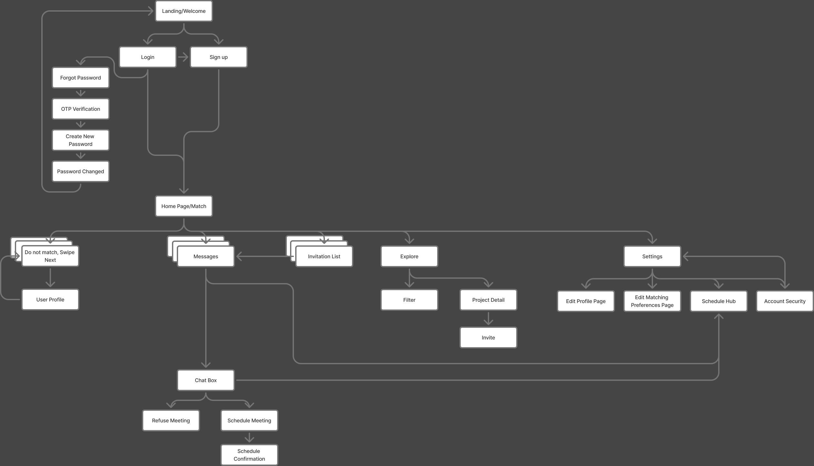
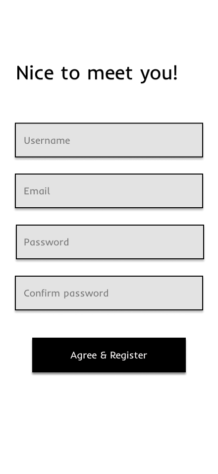
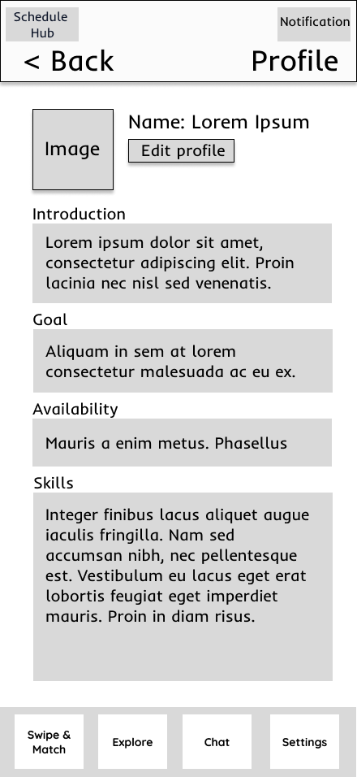
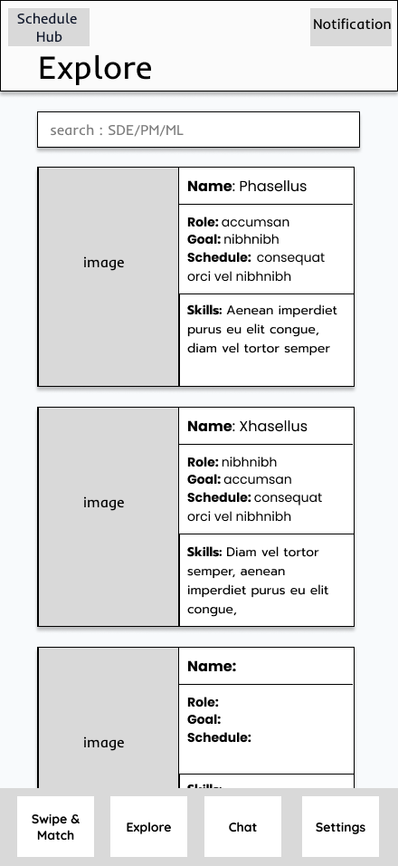
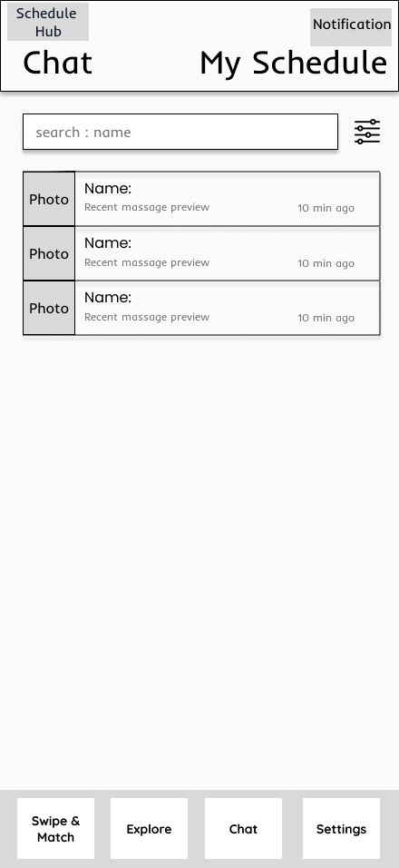
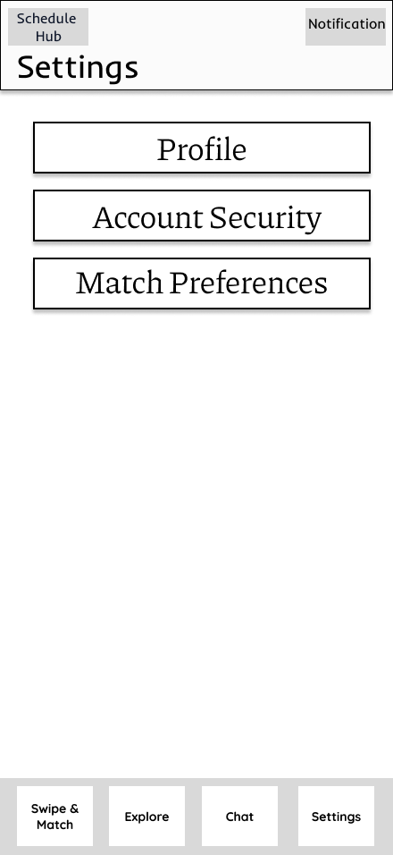
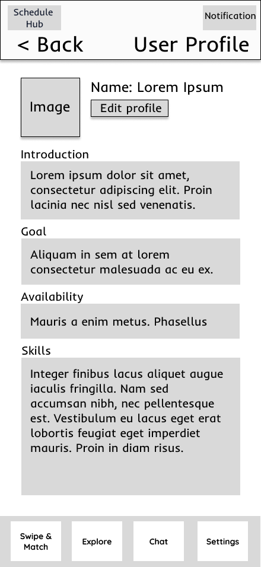
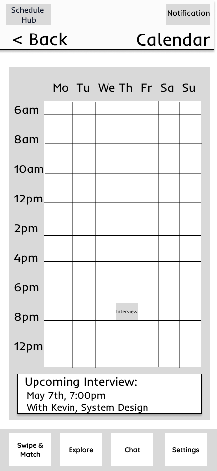

# User Experience Design

## Overview

This document presents the UX design for **PairUp**, including the app map, wireframes, and interactive prototype. The goal of the design is to create a simple and intuitive experience for students looking to build meaningful academic and professional connections.

## Prototype Link

[View the Figma Prototype Here](https://www.figma.com/design/IuEu5cTOjDxrKpG1Rn12nt/Project-PairUp-Prototype?node-id=0-1&t=0JJYilNimyhGmlBK-1)

---

## App Map

### Purpose

The app map shows the overall structure of the PairUp application and how users move between major screens and features.

### App Map Explanation
PairUp begins at the **Landing/Welcome** screen, where users can choose to **Log in** or **Sign up**. If a user forgets their password, they can enter the password recovery flow, which guides them through **Forgot Password**, **OTP Verification**, **Create New Password**, and **Password Changed**, before returning them to log in.

After authentication, users arrive at the **Home Page / Match** screen, which acts as the central hub of the app. From this hub, users can proceed through the core matching flow and view recommended profiles. Users can either skip a recommendation (swipe to the next profile) or open a full **User Profile** for more detail.

From the hub, users can also navigate to key sections:
- **Messages (Chat)** to communicate after connecting
- **Invitation List** to review incoming connection requests and respond
- **Explore** to browse more profiles beyond the default match flow
- **Settings** to manage account details and preferences

Within **Explore**, users can apply a **Filter** to refine what profiles they see. Users can also open **Project Detail** pages and send an **Invite** when they find a relevant collaboration opportunity.

Within **Messages (Chat)**, users can coordinate next steps. Users can either **Refuse Meeting** or **Schedule Meeting**. Scheduling leads to **Schedule Confirmation**, ensuring both parties clearly understand the finalized plan.

Within **Settings**, users can manage:
- **Edit Profile Page**
- **Edit Matching Preferences Page**
- **Schedule Hub**
- **Account Security**

Overall, the app map reflects PairUp’s main goal: help users quickly find relevant connections, communicate efficiently, and take action by scheduling a meeting when appropriate.

---

## Wireframes

The following wireframes represent the key screens and user flows in PairUp. They focus on layout, information hierarchy, and navigation rather than final visual styling. Together, they show how a user moves from account access to matching, exploring profiles, messaging, and scheduling meetings.

---

### 1. Landing / Welcome

**Purpose:** Entry point into the app. Users can choose to log in or register.  
**Notes:** Designed to be minimal so users can quickly choose a path.

---

### 2. Login

**Purpose:** Allows returning users to access their account.  
**Notes:** Includes a clear **Forgot Password** link and a path to registration.

---

### 3. Sign Up

**Purpose:** Allows new users to create an account.  
**Notes:** Collects basic information (username/email/password). The goal is to keep onboarding simple.

---

### 4. Password Recovery Flow

**Purpose:** Helps users regain account access securely.  
**Notes:** Includes **Forgot Password → OTP Verification → Reset/Create New Password → Password Changed** confirmation.

---

### 5. Home / Swipe and Match

**Purpose:** Core matching experience. Users view a recommended profile and decide whether to proceed.  
**Notes:** The wireframe uses button-based input, but the intended final interaction is a swipe-style flow (quick accept/skip). Users can also open a profile for more detail.

---

### 6. User Profile (Detailed View)

**Purpose:** Gives a fuller view of a potential match beyond the preview card.  
**Notes:** Includes self-introduction, goals, interests, skills, and availability/schedule-related information to help users decide whether to connect.

---

### 7. Explore

**Purpose:** Lets users browse additional profiles outside the main match flow.  
**Notes:** Useful for users who want more control than a single recommendation at a time.

---

### 8. Filter (Explore)

**Purpose:** Helps users narrow results in Explore.  
**Notes:** Users can filter by factors like career/goal/skills/schedule and other relevant criteria to improve match relevance.

---

### 9. Project Details

**Purpose:** Provides deeper context about a collaboration opportunity (project overview, required skills, and expectations). User can send an invite from this screen.
**Notes:** Helps users understand whether they are a good fit before sending an invitation.

---

### 10. Invitation List

**Purpose:** Displays incoming invitations/requests and allows users to respond.  
**Notes:** Users can accept or decline invitations to keep request management organized.

---

### 11. Messages (Chat)

**Purpose:** Supports communication between connected users.  
**Notes:** Messaging is essential for coordinating next steps and clarifying details after a match/invite.

---

### 12. Schedule Meeting + Confirmation
.png)

**Purpose:** Enables users to schedule a meeting by selecting a date/time and adding notes.  
**Notes:** After scheduling, the flow leads to a confirmation step (e.g., “Meeting Scheduled”) so both users have clarity.

---

### 13. Settings Hub

**Purpose:** Central place for users to manage their account and preferences.  
**Notes:** Links to profile editing, matching preferences, schedule tools, and account security.

---

### 14. Edit Profile

**Purpose:** Lets users update personal information displayed to others.  
**Notes:** Profile completeness improves match quality and helps others make decisions faster.

---

### 15. Edit Matching Preferences

**Purpose:** Allows users to customize what kinds of matches they receive.  
**Notes:** Improves relevance by aligning recommendations with user goals and interests.

---

### 16. Schedule Hub / Calendar

**Purpose:** Helps users manage availability and upcoming meetings/interviews.  
**Notes:** Serves as a scheduling support area that connects to meeting planning from chat.

---

### 17. Account Security

**Purpose:** Allows users to manage password/security-related settings.  
**Notes:** Helps keep the platform safe and supports account recovery needs.

---

### Non-Obvious Functionality (Clarifications)
- The match flow is intended to be **swipe-based** in the final app, even if the wireframe uses click buttons.
- **Explore + Filter** provides more control for users who prefer browsing over recommendations.
- Scheduling is supported via **Messages (Chat)** and finalized with a **confirmation** step for clarity.
- The wireframes emphasize core UX flow; they do not represent final visuals or backend implementation details.

---

## Conclusion

These wireframes and the app map represent the current UX direction for PairUp. They are intended to show the primary user journey, the purpose of each major screen, and the overall interaction flow of the application.